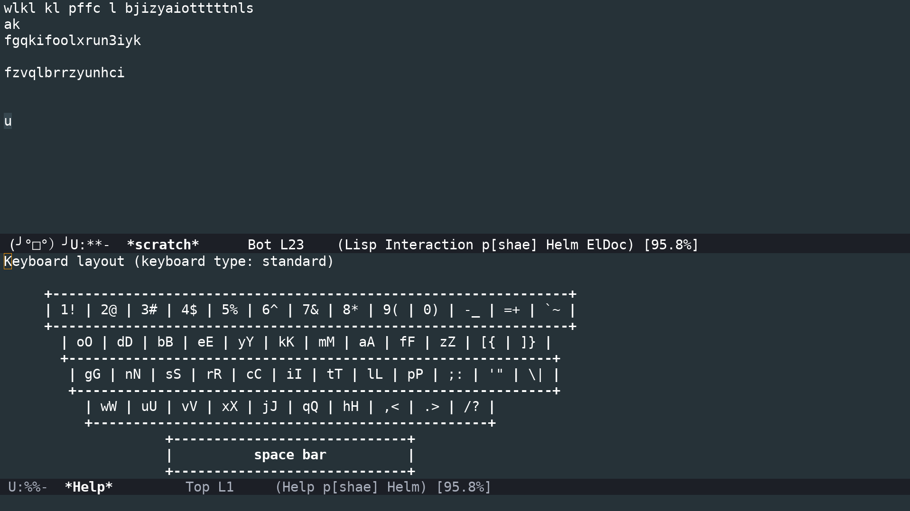

# markovkeyboard
keyboard layout that changes by markov frequency

# the big idea
Static keyboard layouts are boring and predictable. Let's spice up the whole idea of keyboard layouts by having the layout *CHANGE WHILE YOU ARE TYPING*!

The layout will update itself to move the keys that most frequently come next to the home row.
For example, if you type only "the" all day, then when you press the letter 't' the letter 'h' will be on the home row.

# how do I type?
There are minor challenges involved if your keyboard layout could change with every keypress, thus this prototype is an emacs library that displays and updates the current layout with every keypress.

# does it work?

Pretty much! It only remaps the letters from a-zA-Z, but it does work!

# how do I make it go?

Download a plain text file for training the markov chain, then run "python crunch_freqs.py filename.txt" and that will generate a markov-all.el file that you can use with load-library.

After that, use M-x set-input-method and choose markov-insanity-a or replace a with any letter you prefer!

# how do I make it stop?

C-\ is bound to toggle-input-method in stock emacs, and the keybindings are all buffer local, so the code shouldn't make your life too difficult.

# what needs to be done?

- [X] define a new input-method for markov
- [X] display the keyboard layout when enabling the mode
- [ ] port to X11 to ease getting started
